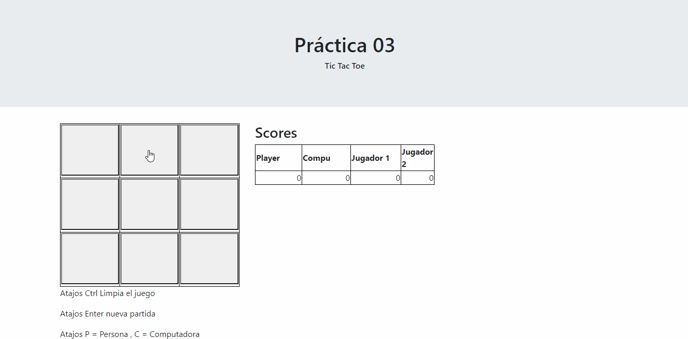
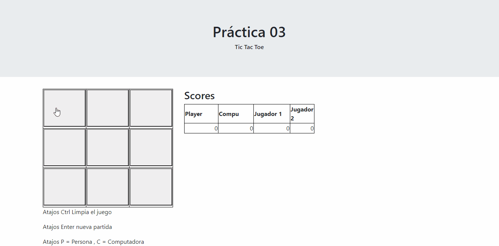

<div>
    <br/>
    <p align="center">
        <a href="#" target="_blank">
            
        </a>
    </p>
    <br>
    <div>
        <p align="center">
        Tic<a href="#" >-Tac-</a>Toe
        </p>
    </div>
    <div>
        <p align="center">
            <a href="#" target="_blank">Java</a> | <a href="#" target="_blank">C++</a> | <a href="#" target="_blank">JavaScript</a>
        </p>
    </div>
</div>

## Funciones
- Funcionalidad del juego del Tic-Tac-Toe de jugador vs jugador.
- Contador de cuántas veces ha ganado el jugador.
- Reinicio para volver a jugar.
- Muestra un mensaje de quien gano.



## Instalacion

#### Paso 1:
```
Abrir el tictactoe.html
```

## Acerca de:
Este proyecto es realizado por [Luis Gerardo](https://github.com/GitLuisG)